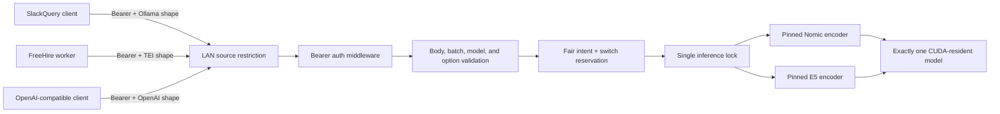

# Architecture

Embedserve is one authenticated HTTP process and one GPU-resident encoder. It sits on a
trusted LAN behind source restrictions. Every HTTP route passes through constant-time
bearer authentication before request parsing or model work.

The native draw.io source is `docs/architecture.drawio`. GitHub cannot render every
draw.io file inline; the equivalent Mermaid view is included here.

## Boundaries

- Clients own text semantics. SlackQuery adds task prefixes and post-processes vectors.
- The API owns authentication, request limits, model allowlisting, serialization, and
  single-process inference admission.
- The runtime owns pinned model loading, Nomic's 2048-token/raw contract, E5's
  512-token/normalized contract, unload cleanup, and native-dimension validation.
- systemd owns one-process enforcement, restart behavior, filesystem restrictions, and
  the model-cache directory.
- Network policy owns source-host restriction. The bearer key is defense in depth, not
  a substitute for a private route.

## Current state

Release `0.2.x` starts with Nomic and switches only between two pinned allowlisted
models. Request data cannot load arbitrary repositories. Alternate intent blocks fresh
old-model admissions, reserves a bounded handoff, unloads the old model, verifies CUDA
allocator release, and loads the alternate model once. The first claimant's cancellation
cannot cancel the internal switch task. Abandoned reservations expire and a minimum
residency window limits thrashing.
