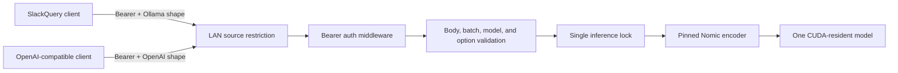

# Architecture

Embedserve is one authenticated HTTP process and one GPU-resident encoder. It sits on a
trusted LAN behind source restrictions. Every HTTP route passes through constant-time
bearer authentication before request parsing or model work.

The native draw.io source is `docs/architecture.drawio`. GitHub cannot render every
draw.io file inline; the equivalent Mermaid view is included here.

## Boundaries

- Clients own text semantics. SlackQuery adds task prefixes and post-processes vectors.
- The API owns authentication, request limits, model allowlisting, serialization, and
  single-process inference admission.
- The encoder owns pinned model loading, the 2048-token limit, raw FP32 inference, and
  native-dimension validation.
- systemd owns one-process enforcement, restart behavior, filesystem restrictions, and
  the model-cache directory.
- Network policy owns source-host restriction. The bearer key is defense in depth, not
  a substitute for a private route.

## Current state

Release `0.1.x` loads Nomic once at startup. There is no dynamic model endpoint and no
arbitrary remote loading. A later release will add E5 behind a synchronized coordinator;
until that state machine is implemented and tested, this service remains Nomic-only.
